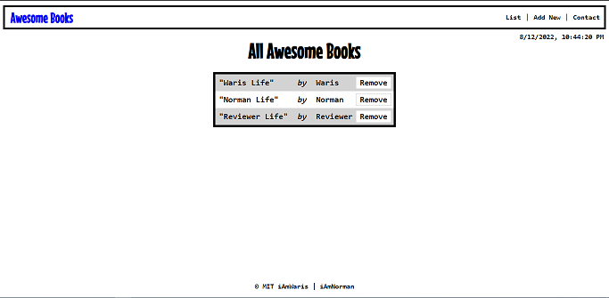

# AwesomeBooks

> Js Project to create CRUD Book List

## Built With

- JS
- HTML
- CSS

## Getting Started
This is a simple HTML/JS project.

## Authors

👤 **Waris Haleem**

- GitHub: [iAmWaris97](https://github.com/iAmWaris97)
- Twitter: [@iAmWaris97](https://twitter.com/iAmWaris97)

👤 **Norman Ainobushoborozi**

- GitHub: [normainobary2021](https://github.com/normainobary2021)
- Twitter: [@NormanAinobush2](https://twitter.com/NormanAinobush2)

## 🤝 Contributing

Contributions, issues, and feature requests are welcome!

Feel free to check the [issues page](../../issues/).

## Show your support

Give a ⭐️ if you like this project!

## 📝 License

This project is [MIT](./MIT.md) licensed.